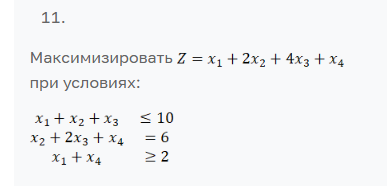
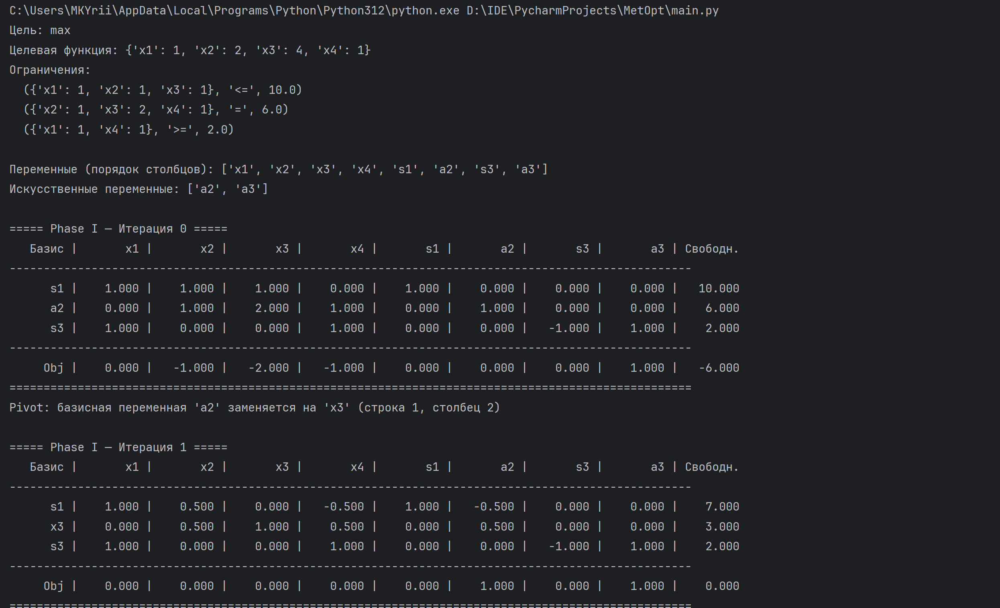
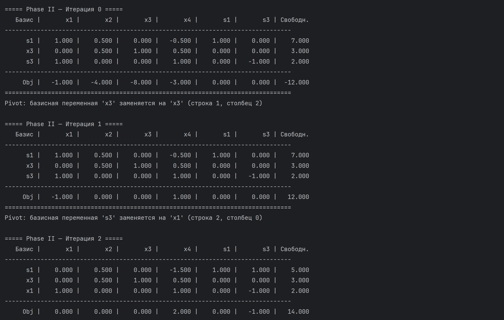
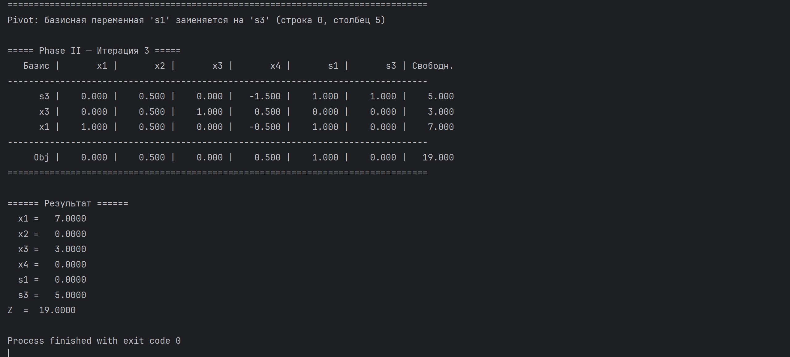
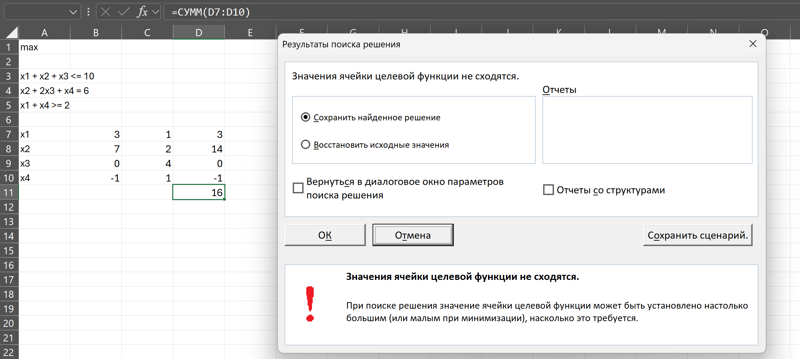

# Михайлов Юрий Алексеевич

## МетОпт 1.2

## Описание алгоритма

Задача линейного программирования (ЗЛП) решается с использованием двухфазного симплекс-метода, реализованного без использования специализированных библиотек.
Алгоритм состоит из следующих этапов:

1. Считывание данных из файла

* Программа загружает коэффициенты целевой функции, матрицу ограничений и знаки ограничений из текстового файла.

2. Приведение задачи к каноническому виду

* Все неравенства приводятся к равенствам путём введения дополнительных переменных (slack, surplus, artificial).

* Формируется расширенная матрица системы уравнений.

3. Формирование вспомогательной задачи (фаза 1)

* Если присутствуют уравнения «=» или «≥», вводятся искусственные переменные.

* Целевая функция вспомогательной задачи: минимизация суммы искусственных переменных.

* Решение вспомогательной задачи используется для нахождения допустимого базисного решения исходной задачи.

4. Решение вспомогательной задачи симплекс-методом (фаза 1)

* На каждом шаге определяется ведущий столбец (максимальный положительный коэффициент в строке целевой функции).

* Определяется ведущая строка (по минимальному положительному отношению свободного члена к ведущему коэффициенту).

* Выполняется поворот таблицы (переход к новому базису).

* Процесс повторяется, пока все коэффициенты целевой функции не станут неположительными.

5. Переход к основной задаче (фаза 2)

* Искусственные переменные исключаются.

* На основе найденного допустимого базиса решается исходная задача максимизации.

6. Вывод результата

Программа печатает:

* промежуточные симплекс-таблицы с подписями переменных;

* итоговое оптимальное решение в виде

𝑥∗=(𝑥1 , 𝑥2 , 𝑥n), Z(𝑥∗) = max Z

## Для запуска программы необходимо загрузить файлы input.txt и main.py в одну папку, а затем запустить main.py.

## Вариант задания (11 вариант):

## Пример работы:

Для наглядности и проверки, я добавил в программу вывод всех этапов решения.

## Также согласно заданию я сравнил результат работы программы с работой поиска решения в экселе:

В результате он практически нашел правильное решение, но почему-то поставил для x4 значение -1, когда оптимальным и допустимым являлся 0

## Вывод

В ходе лабораторной работы я лучше понял, как работает симплекс метод, так как пришлось самому реализовывать все методы и шаги,
включая необходимые ограничения и проверки на бесконечность и прочее. Также поработал с массивами и аккуратной индексацией