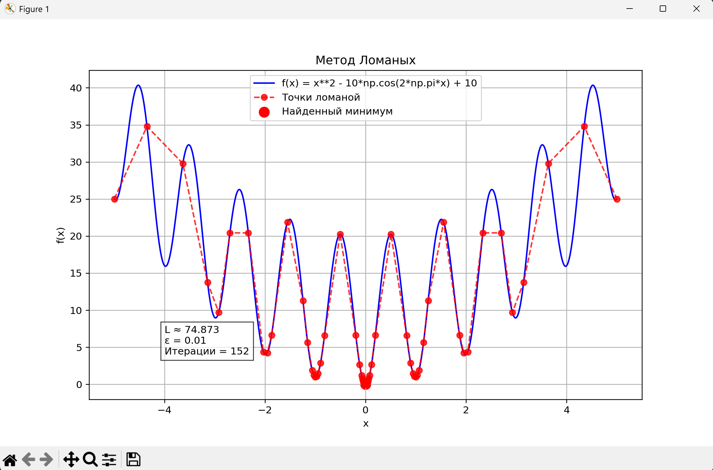

# Михайлов Юрий Алексеевич

## МетОпт 1.2

## Описание алгоритма

### Метод ломаных

1. Задаются концы отрезка ([a, b]), функция (f(x)), константа Липшица (L) и точность (eps).
2. Вычисляются (f(a)), (f(b)).
3. Для каждого интервала ([x_i, x_{i+1}]) строится нижняя оценка функции (m_i).
4. Находится интервал с наименьшей (m_i).
5. В этом интервале вычисляется новая точка (x_i^*), где нижняя оценка достигает минимума.
6. Новая точка добавляется в список узлов, значения сортируются по возрастанию (x).
7. Повторять шаги 3–6, пока разница между текущим лучшим значением функции и минимальной нижней оценкой не станет меньше (\varepsilon).
8. В качестве приближённого глобального минимума принимается точка, соответствующая минимальному значению (f(x)).

## уточнения по работе

- при запуске программы (файла main) сначала выводится график функции и точек ломаных в процессе работы алгоритма, а затем результаты работы и подсчет нужных метрик

- расчет константы L при отсутствии ввода выполняется автоматически (можно также задать вручную): 
функция estimate_lipschitz оценивает 𝐿 как максимум ∣Δf/Δx∣ на равномерной сетке

## пример работы программы с функцией Растригина:



```
Оцененная константа Липшица: L ≈ 74.8729

==== РЕЗУЛЬТАТЫ ====
Функция: f(x) = x**2 - 10*np.cos(2*np.pi*x) + 10
Приближённый минимум: x = 0.00000, f(x) = 0.00000
Оценка Липшица: L ≈ 74.8729
Число итераций: 152
Время работы: 0.0200 сек.
```

## Вывод

В ходе лабораторной работы я разобрался с методом ломаных и принципом поиска глобального экстремума для липшицевых функций. 
Мною самостоятельно были реализованы все шаги алгоритма — от оценки константы Липшица до последовательного построения и уточнения ломаной, что помогло глубже понять саму идею метода и отличие его от простого перебора по значениям. 
Также поработал с визуализацией графиков функции и вспомогательных линий. 
Работа позволила лучше понять, как на практике строятся численные алгоритмы оптимизации.
